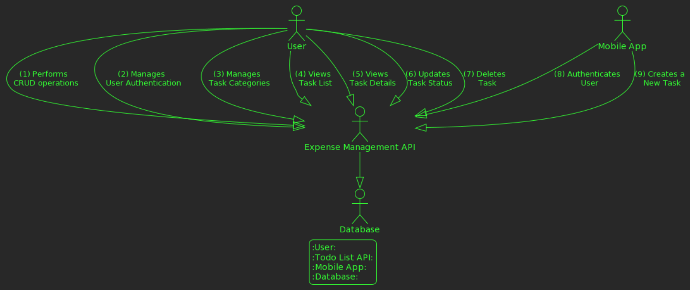

# Expense Tracking System - GoFr Golang

A simple HTTP (REST) API for managing expenses of a user. The API supports CRUD operations and integrates with a database for data persistence.

## Table of Contents

- [Features](#features)
- [Getting Started](#getting-started)
  - [Prerequisites](#prerequisites)
  - [Installation](#installation)
  - [Running the API](#running-the-api)
- [API Endpoints](#api-endpoints)
- [Usage Examples](#usage-examples)
- [Testing](#testing)
- [Contributing](#contributing)

## Features

- Create, Read, Update, and Delete tasks.
- User authentication for personalized task management.
- Manage task categories for better organization.

## Getting Started

### Prerequisites

- Go programming language installed
- PostgreSQL database (can be run using Docker)

### Installation

1. Clone the repository:

   ```bash
   git clone https://github.com/PragyaS-cyber/Expense_Tracker_golang.git
   cd expense_tracker
   ```

clone the repository: https://github.com/PragyaS-cyber/Expense_Tracker_golang.git

### link for the repository : https://github.com/PragyaS-cyber/Expense_Tracker_golang

