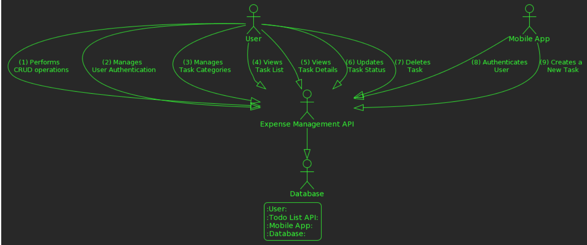

# Expense Tracking System - GoFr Golang

A simple golang project which incorporates GoFr framework developed which tracks the expenses of an individual by adding, removing, updating financial expenses.

## CRUD operations:
Create
Read
Update
Delete

clone the repository: https://github.com/PragyaS-cyber/Expense_Tracker_golang.git

### link for the repository : https://github.com/PragyaS-cyber/Expense_Tracker_golang

